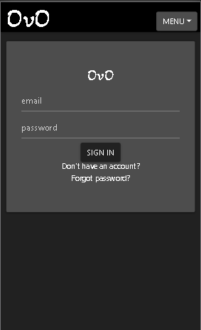
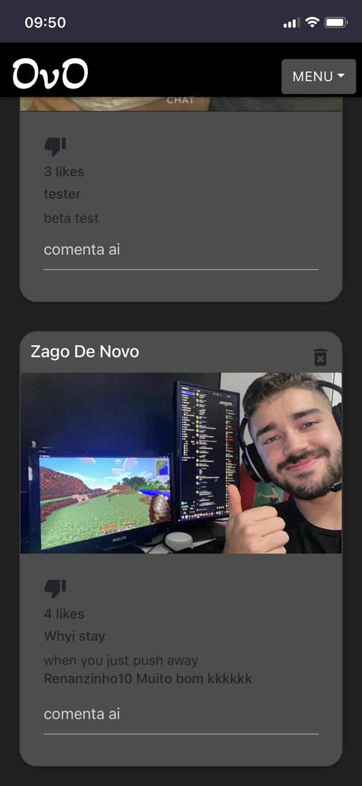

# OvO
### *Under Development by the QueRy Team and MecBonjourno
The Public Repository for OvO, a Custom Social Network

## OvO

At the moment OvO is a great working and updated copy of instagram builded full stack with MERN Stack.
(Works only with google chrome)

Features 100% working:

 - Follow someone
 - Unfollow them
 - Post photos
 - Comment on other photos
 - login
 - SignUp
 - See only followed post
 - Profile populate with data from backend

    And more to come...

[NotOvO](http://notovo.herokuapp.com)

[QueRy](https://querymobile.co)
